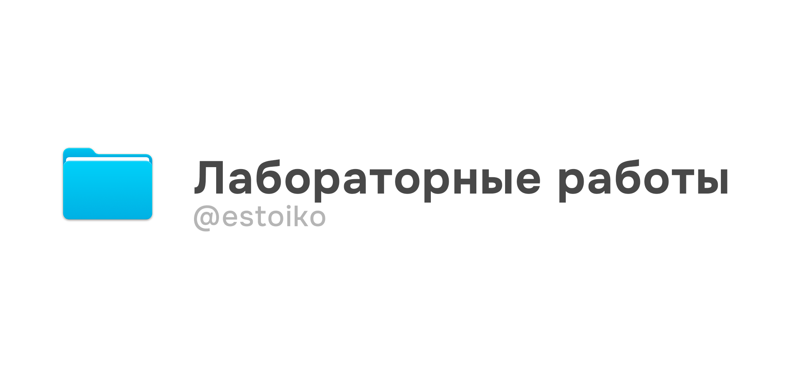

# polytech

  

## Структура
- [**AP**](https://github.com/estoiko/polytech/tree/293510e40eecbad27e3679341241d8dac4bdb186/AP) - "Алгоритмозация и программирование"
- [**GNU_Linux**](https://github.com/estoiko/polytech/tree/293510e40eecbad27e3679341241d8dac4bdb186/GNU_Linux) - "Системное программное обеспечение GNU/Linux"

## Содержание

### AP
_tasks_
1. [Задача про кирпич](AP/task1)
2. [Задача про координатные четверти](AP/task2)

### GNU_Linux
1. [Основы командной строки](GNU_Linux/lab1)
2. [Регулярные выражения и управление заданиями](GNU_Linux/lab2)
3. [Перенаправление ввода-вывода](GNU_Linux/lab3)
